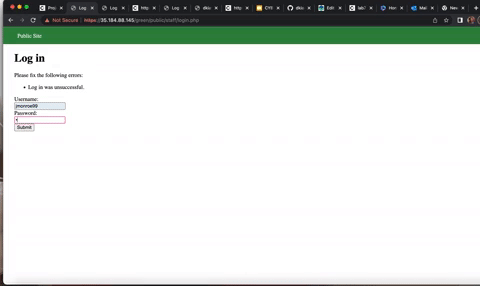
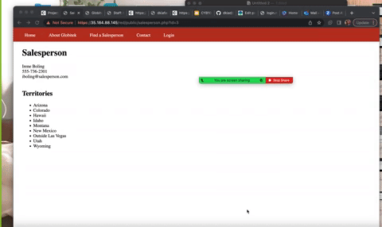

Each color is vulnerable to only 2 of the 6 possible exploits. First discover which color has the specific vulnerability, then write a short description of how to exploit it, and finally demonstrate it using screenshots compiled into a GIF.

## Green

Vulnerability #1: Username Enumeration

Description:

- I went through all three of the sites and tried the username “jmonroe99”. Once I tried the username, I noticed the changes. One website the statement was bold and the other was not.  
## Blue

Vulnerability #1: Cross Site Scripting 
Description:
- I used my safari as my second browser and trusted the website. I used the  "public/hacktools/change_session_id.php”. I changed the end of the URL on both pages. Once, changing the URL for both browsers, I was able to login on them both. 

## Red

Vulnerability #1: Insecure Direct Object Reference
Description: I wasn’t able to use Burp. However, Recognizing the differences between the contact profiles, I was able to guess the number of private profiles. The website was very vulnerable, due to me being able to access the private sales list without being an official admin. 

